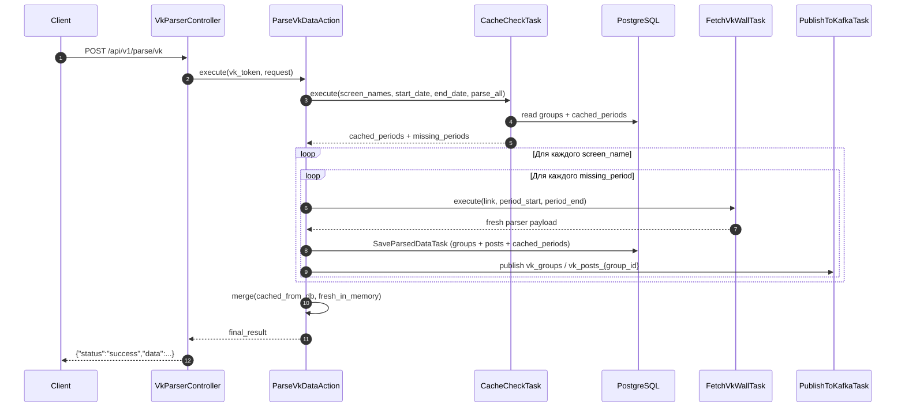

# Parser Flow

## Обзор

`POST /api/v1/parse/vk` работает по гибридной модели `cache-first + broker-fanout`.

1. `ParseVkDataAction` извлекает `screen_name` из входных ссылок.
2. `CacheCheckTask` читает `groups` и `cached_periods`, чтобы определить `missing_periods`.
3. Для каждого gap-а action вызывает внутренний VK runtime-слой только на недостающий интервал.
4. Свежий payload сначала сохраняется в PostgreSQL через `SaveParsedDataTask` (`groups`, `posts`, `cached_periods`), затем параллельно публикуется в Kafka через `PublishToKafkaTask`.
5. Ответ клиенту собирается как merge `cached из БД + fresh из parser result in-memory`.

Это важно: PostgreSQL используется и как read-cache, и как primary write-target для парс-запроса (границы окна парсинга знает только сам action). Kafka остаётся fanout-каналом для внешних consumer'ов (`vk-channel-consumer`, `vk-posts-consumer`).

> NOTE (backlog): в будущем возможен полноценный `broker-first` вариант, где `cached_periods` тоже наполняются через отдельный Kafka consumer VKParser. Для этого надо расширить контракт `KafkaGroupMessage`/`KafkaPostMessage` полями `period_start`/`period_end` и завести consumer внутри сервиса.

## Sequence



## Ключевые правила

- Full cache hit: если `missing_periods` пусты, VK API не вызывается, а ответ строится только из БД.
- Partial cache hit: action вызывает parser отдельно по каждому gap-у из `missing_periods`.
- `parse_all=true`: `CacheCheckTask` всё ещё может форсировать полный дозапрос диапазона, если данные устарели.
- Свежие данные после `FetchVkWallTask` сразу же upsert-ятся в PostgreSQL (`SaveParsedDataTask`) вместе с соответствующей записью в `cached_periods`.
- `SaveParsedDataTask` и `PublishToKafkaTask` оба обернуты в try/except и логируются как warning — одна ошибка одной интеграции не валит parse-response.
- Merge делается внутри action по in-memory данным, а не по результату чтения только что записанной БД.

## Merge ответа

Для каждого домена action объединяет:

- cached payload, восстановленный из `groups` + `posts`
- fresh payload, полученный от внутреннего parser runtime по одному или нескольким `missing_periods`

Правила merge:

- `posts_count` и `period_posts_metrics` пересчитываются по объединённому набору постов
- `top_posts` и `down_posts` пересобираются из объединённых кандидатов
- `graph_data` объединяется и дедуплицируется
- метаданные домена (`id`, `name`, `screen_name`, `members_count`) берутся из fresh payload, если он есть

## Как считаются gaps

`CacheCheckTask` работает по `cached_periods`, отсортированным по `period_start`.

- Кешированные интервалы трактуются как inclusive.
- Для исключения повторного чтения на границах gap вычисляется с шагом `1 microsecond`.
- Это не меняет broker-first семантику, но помогает не парсить граничные записи повторно.

Упрощённо:

```python
current = request_start
for cached_period in sorted(cached_periods):
    if current <= cached_period.start - 1 microsecond:
        missing.append((current, cached_period.start - 1 microsecond))
    current = max(current, cached_period.end + 1 microsecond)

if current <= request_end:
    missing.append((current, request_end))
```

## Kafka Contract

На request-path публикуются:

- `vk_groups`
- `vk_posts_{group_id}`

Payload остаётся совместимым с текущими DTO:

- `KafkaGroupMessage`
- `KafkaPostMessage`

`PublishToKafkaTask` сам поднимает `AIOKafkaProducer`, публикует пакет и закрывает producer в рамках вызова, если producer не был передан извне.

## Что важно для поддержки

- Если partial hit снова теряет уже закешированные посты, проверять merge в `ParseVkDataAction`, а не Kafka consumer.
- Если сервис догружает весь диапазон вместо gap-ов, проверять `CacheCheckTask.calculate_missing_periods()` и цикл по `missing_periods`.
- Если `cached_periods` остаётся пустой даже после успешного парса, проверять вызов `SaveParsedDataTask` внутри цикла `missing_periods` и логи с `"SaveParsedDataTask failed, continuing"`.
- Если parse-response не включает свежие данные, значит сломан in-memory merge.
- Если данные публикуются в Kafka, но не появляются в downstream сервисах, искать проблему уже в downstream consumer (`vk-channel-consumer`, `vk-posts-consumer`), а не в parse endpoint.

## Проверка

```bash
PYTHONPATH=. uv run pytest tests/ -q
uv run ruff check src tests
```

## См. также

- [API Reference](./api.md)
- [Architecture](./architecture.md)
- [Authentication](./authentication.md)
